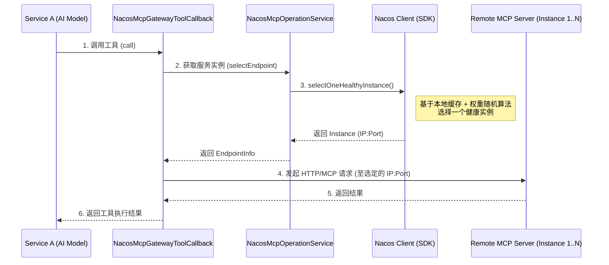

# Spring AI Alibaba MCP Gateway 集成与负载均衡原理解析

本文档分析**服务 A**（作为 MCP Client/Consumer）如何通过引入 `spring-ai-alibaba-starter-mcp-gateway` 实现对远程 MCP 服务的负载均衡调用。

## 1. 核心架构与依赖

### 1.1 场景描述
*   **服务 A**: 业务应用，集成了 Spring AI Alibaba。
*   **依赖**: `spring-ai-alibaba-starter-mcp-gateway`。
*   **依赖作用**: 该 Starter 将 `mcp-gateway` 以库的形式嵌入到服务 A 中，使其具备动态感知和调用远程 MCP Server 的能力。

### 1.2 Maven 依赖
服务 A 只需引入 Starter：

```xml
<dependency>
    <groupId>com.alibaba.cloud.ai</groupId>
    <artifactId>spring-ai-alibaba-starter-mcp-gateway</artifactId>
</dependency>
```

`mcp-gateway` Starter 内部传递依赖了：
*   `spring-ai-alibaba-mcp-common` (核心 Nacos 对接逻辑)
*   `nacos-client` (服务发现能力)
*   `spring-ai-mcp` (Spring AI 标准接口)

---

## 2. 关键类与初始化流程

当服务 A 启动时，Spring Boot 自动配置机制加载 MCP Gateway 组件。

### 2.1 核心配置类 (AutoConfiguration)
**类名**: `NacosMcpGatewayAutoConfiguration`
**位置**: `spring-ai-alibaba-autoconfigure-mcp-gateway`

*   **职责**:
    1.  初始化 `NacosMcpOperationService`：负责与 Nacos Server 通信。
    2.  初始化 `NacosMcpGatewayToolsWatcher`：负责监听 Nacos 中的 MCP 服务变更。
    3.  注册 `McpGatewayToolManager`：负责管理动态生成的 Tool Callbacks。

### 2.2 核心组件

| 组件名 | 位于模块 | 作用 |
| :--- | :--- | :--- |
| `NacosMcpGatewayProperties` | Starter | 读取 `spring.ai.alibaba.mcp.gateway.service-names` 配置，确定服务 A 需要订阅哪些 MCP 服务。 |
| `NacosMcpOperationService` | Common | **核心服务**。封装了 Nacos `NamingService` 和 `ConfigService`，提供服务发现和元数据获取能力。 |
| `NacosMcpGatewayToolsWatcher` | Gateway | **动态发现**。启动监听器，当远程 MCP 服务上线/下线或元数据变更时，动态向 Spring AI 上下文添加/移除 Tool。 |
| `NacosMcpGatewayToolCallback` | Gateway | **执行代理**。每一个远程 MCP Tool 在服务 A 本地都对应一个 Callback 实例，它是实际发起远程调用的地方。 |

---

## 3. 负载均衡调用流程 (Load Balancing)

服务 A 的 AI 模型发起的每一次工具调用，都会经过以下链路，实现**客户端侧负载均衡**。

### 3.1 详细步骤

#### 第一步：AI 模型发起调用
服务 A 的 AI 模型决定调用某个工具（例如 "weather_tool"），Spring AI 框架查找到对应的 `NacosMcpGatewayToolCallback` 实例并执行 `call()` 方法。

#### 第二步：回调执行 (`NacosMcpGatewayToolCallback.call`)
该类是运行在服务 A 进程内的代理。
*   **输入**: 工具参数（JSON）。
*   **动作**: 准备发起 HTTP/MCP 请求。

#### 第三步：负载均衡选择实例 (`NacosMcpOperationService.selectEndpoint`)
在 `NacosMcpGatewayToolCallback` 内部，调用核心服务获取目标地址：

```java
// 代码位置: NacosMcpGatewayToolCallback.java
McpEndpointInfo mcpEndpointInfo = nacosMcpOperationService.selectEndpoint(serviceRef);
```

**关键实现 (`NacosMcpOperationService`)**: （spring-ai-alibaba-mcp-common提供）
1.  该服务内部持有 Nacos `NamingService`。
2.  调用 `namingService.selectOneHealthyInstance(serviceName, groupName)`。(nacos-client提供)
3.  **负载均衡算法**:
    *   **本地计算**: Nacos Client 会在服务 A 本地缓存服务列表。
    *   **策略**: 默认基于**权重 (Weight)** 的**随机 (Random)** 负载均衡策略。
    *   **健康检查**: 自动过滤掉不健康的实例。

#### 第四步：构建连接与执行
拿到目标实例的 IP 和 Port 后：
*   **Http/Https**: 直接构建 `WebClient` 请求目标地址。
*   **Mcp-Streamable**: 构建通过目标地址的流式传输通道。

### 3.2 流程图解



---

## 4. 总结

服务 A 实现负载均衡完全依赖于引入的 **Starter** 和其底层的 **Nacos Client**。

1.  **Mcp Gateway Starter**: 让服务 A 能够把远程 MCP 服务伪装成本地 Tool。
2.  **Nacos Client**: 在服务 A 内部维护服务列表缓存，并提供基于权重的客户端负载均衡算法。
3.  **零代码**: 服务 A 开发者无需编写负载均衡代码，只需配置依赖的服务名，Starter 自动处理寻址和调用。
